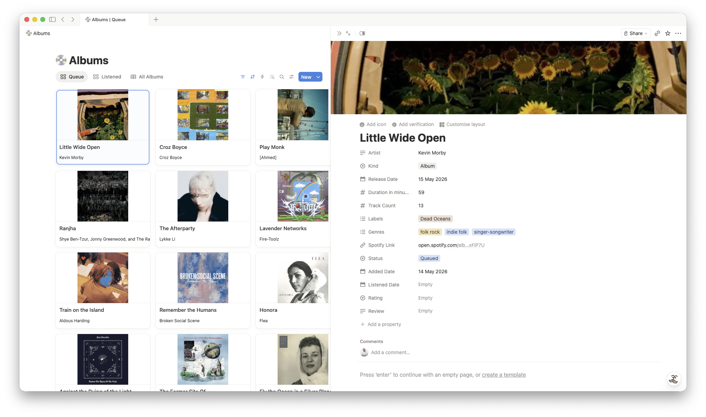

# record.club → Notion

Sync your public record.club activity RSS feed into a Notion Albums database. Imports queue additions and listened/rated diary activity, then enriches albums with covers and MusicBrainz metadata when available. Runs on Notion Workers, no server or cron required.

This project is adapted from Brian Lovin's [`letterboxd-notion-sync`](https://github.com/brianlovin/letterboxd-notion-sync) Notion Worker pattern. The source integration and Notion schema have been replaced for record.club albums.

## What syncs

- Queue activity → `Status = Queued`
- Listened/rated diary activity → `Status = Listened`
- Metadata → release date, labels, track count, duration, genres, Spotify link, and cover art when available

Matching is based on kind, artist, and title, so a later listened/rated entry updates an earlier queued row.

## Limitations

- One-way sync only: record.club has a public read feed, but no supported write API.
- Queue removals are not mirrored because RSS does not expose the current full queue.
- Listened/rated albums sync only when record.club emits diary/review activity with a rating and listened date. Simply marking a release as listened is not enough.
- Metadata is best-effort via MusicBrainz and Spotify; genres and external links depend on upstream data.

## Setup

```bash
curl -fsSL https://ntn.dev | bash
ntn login
```

```bash
npm install
npm run setup
```

Setup asks for a Notion Personal Access Token, your record.club username, and optional Spotify credentials. It creates a `💿 Albums` database with Queue / Listened / All Albums views, writes `.env`, deploys the worker, and triggers the first sync.

```bash
npm run setup:preview # show the setup flow
npm run setup:dry-run # test prompts with fake values
```

## Lazymode

Paste this repo link into Claude Code, Codex, or another coding agent and ask:

```text
Set this up for me: https://github.com/riccardoerra/record-club-notion-sync

Use my record.club username YOUR_USERNAME. Guide me through the Notion token / Notion Workers setup and deploy the worker.
```

The agent should clone the repo, install dependencies, run `npm run setup`, help you provide a Notion token, deploy the worker, and trigger the first sync.

## Maintenance

```bash
ntn workers sync trigger recordClubSync
ntn workers sync status
ntn workers runs list
npm run backfill
npm run backfill -- --force
```

Edit `schedule: "1d"` in `src/index.ts` and run `ntn workers deploy` to change the cadence.
